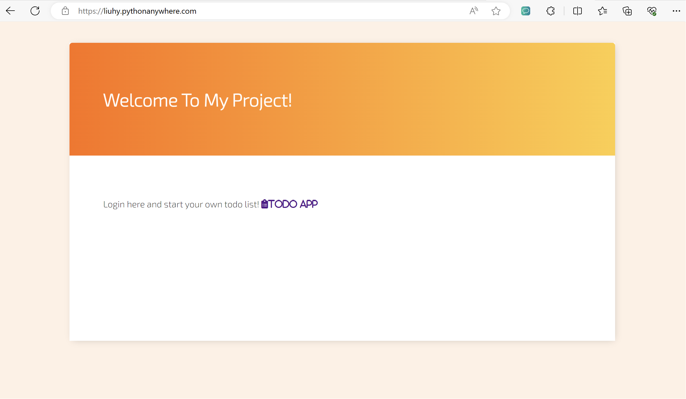
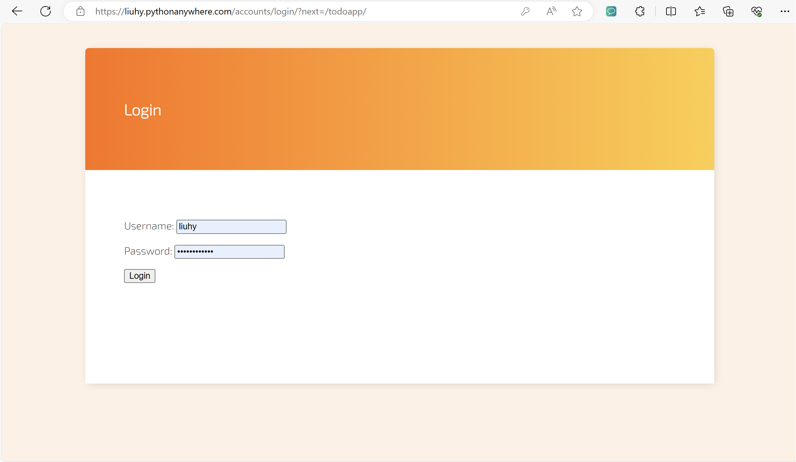
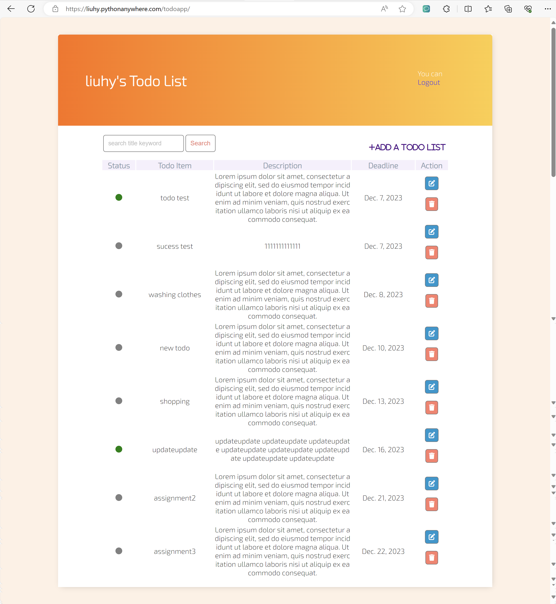
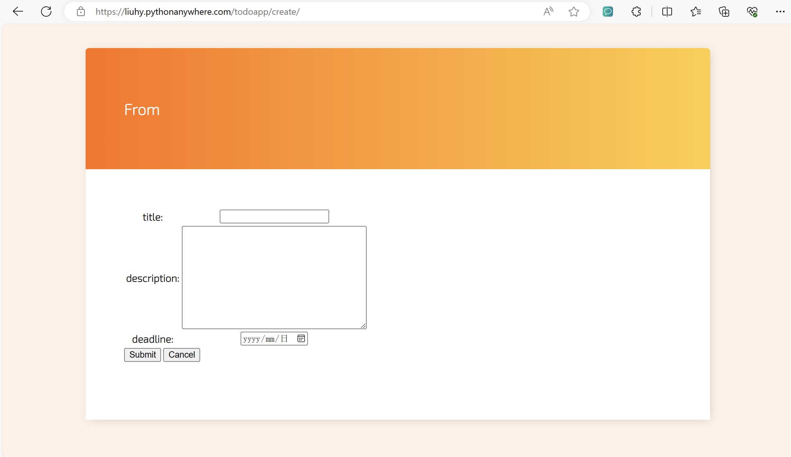
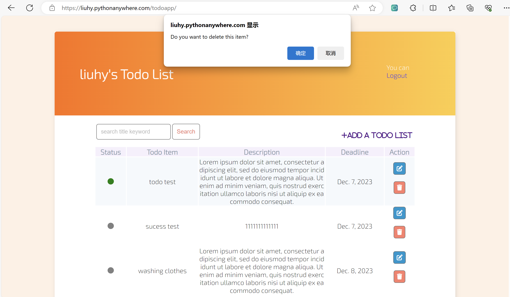
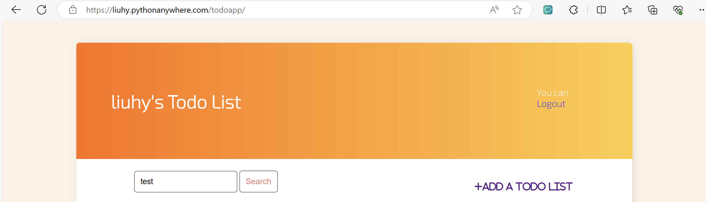
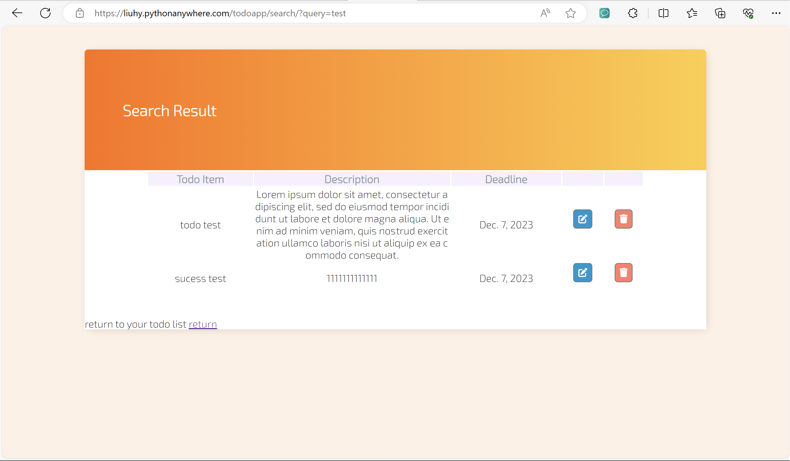
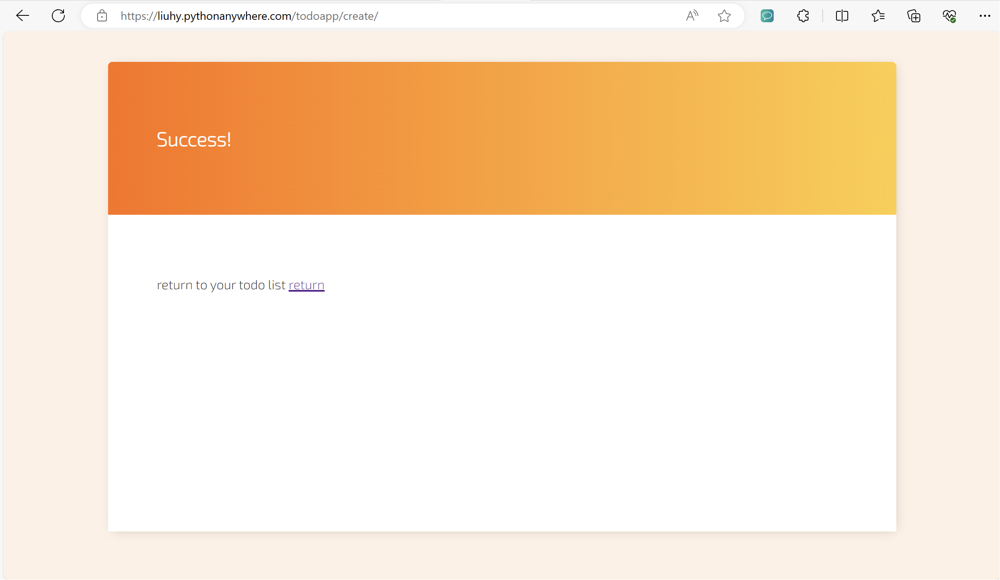

<h1 align="center">Django Todolist</h1>

### :page_facing_up: Introduction

The website is a multi-purpose web application based on the Django framework and Python with an integrated to-do management system, designed to provide a simple and easy-to-use user experience.

To-do Management System (TodoApp)
The To-do Management System helps users manage daily tasks. Its specific functions include:

    Add Task: Users can add new to-do tasks and set the task content, priority and deadline.

    Update Task: Users can edit the content and properties of existing tasks at any time.

    Delete Task: After completing a task, users can delete it.

    Select List: Users can view all to-do tasks, sorted by priority and deadline.

Home Page (Home)
The Home Page provides basic information and navigation of the website. Its main functions include:

    Personalized Content: Displays the user's personalized information and statistics.

    Navigation: Provides links and entrances to other functional modules.

### :fireworks: show results

